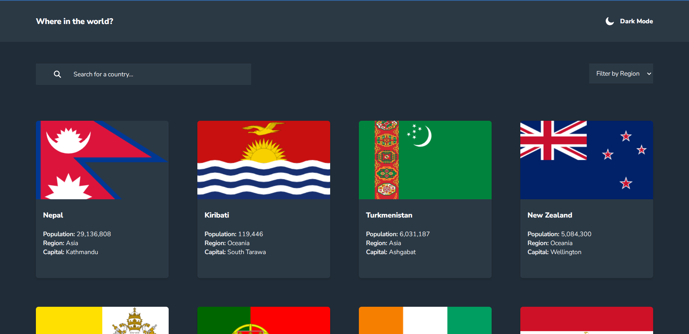
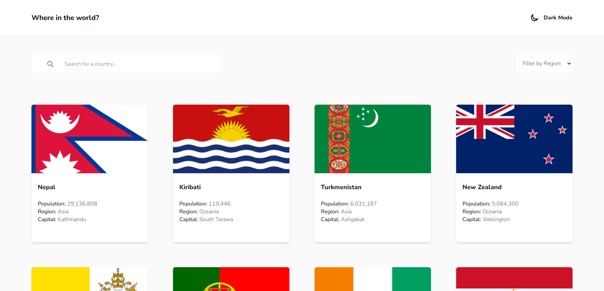
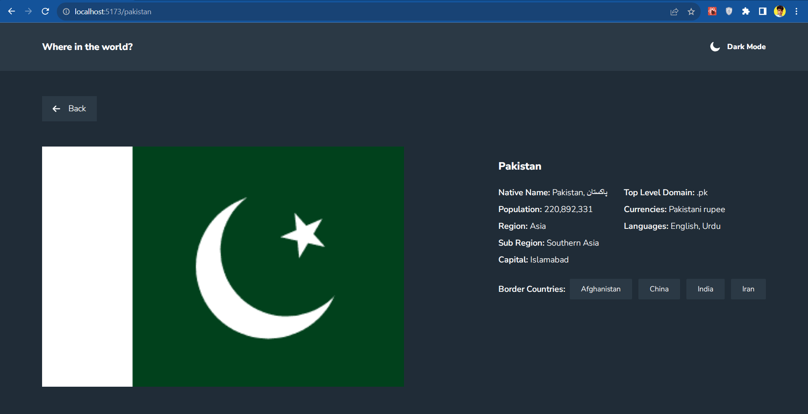
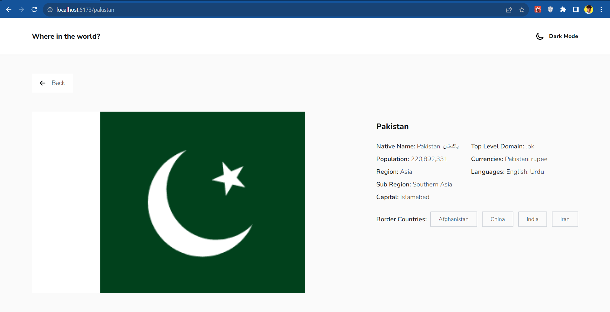

# Frontend Mentor - REST Countries API with color theme switcher solution

This is a solution to the [REST Countries API with color theme switcher challenge on Frontend Mentor](https://www.frontendmentor.io/challenges/rest-countries-api-with-color-theme-switcher-5cacc469fec04111f7b848ca). Frontend Mentor challenges help you improve your coding skills by building realistic projects.

## Table of contents

- [Overview](#overview)
  - [The challenge](#the-challenge)
  - [Screenshot](#screenshot)
  - [Links](#links)
- [My process](#my-process)
  - [Built with](#built-with)
  - [What I learned](#what-i-learned)
- [Author](#author)

## Overview

This was a challenge by frontendmentor. I had to use the restcontries api (free) to fetch the countries, search the countries, filter the countries and also see detailed view of country by clicking on either image of country or country name on country card. If you click on border country name on details page, it will open detail page for that border country. Although the dark and light theme toggle was optional, but I implemented it anyways because it is a good user experience.

### The challenge

Users should be able to:

- See all countries from the API on the homepage
- Search for a country using an `input` field
- Filter countries by region
- Click on a country to see more detailed information on a separate page
- Click through to the border countries on the detail page
- Toggle the color scheme between light and dark mode _(optional)_

### Screenshots

### Homepage - Dark Mode

### Homepage - Light Mode

### Details Page - Dark Mode

### Details Page - Light Mode

### Links

- Github repo URL: [Github Repository](https://github.com/AbroShahzeb/countries-app-with-api/)
- Live Site URL: [See Live Demo](https://abroshahzeb.github.io/countries-app-with-api/)

## My process

Implemented the UI using tailwind CSS and React first. Then called the API and filled the pages with dynamic data. Used React Router Dom for routing.

### Built with

- Semantic HTML5 markup
- Tailwind CSS
- Flexbox
- CSS Grid
- Mobile-first workflow
- [React](https://reactjs.org/) - JS library

### What I learned

Learn to work with filtering the data, dark and light mode toggling. Learnt how react router works.

## Author

- Frontend Mentor - [@AbroShahzeb](https://www.frontendmentor.io/profile/AbroShahzeb)
